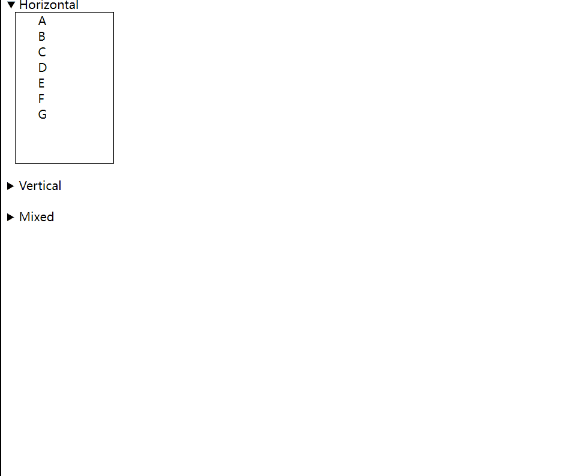

# react-multilevel-menu-aim
react version for https://github.com/kamens/jQuery-menu-aim




## usage

```
import { MenuAim, Menu, SubMenuPanel } from 'react-multilevel-menu-aim'

const Horizontal = () => {
  return <MenuAim>
    <div className='menu'>
      <ul style={{ left: 10, top: 0 }}>
        {'ABCDEFG'.split('').map(x => <Menu key={x}>
          <li>
            <a>{x}</a>
            <SubMenuPanel>
              <ul>
                {'123456789'.split('').map(y => <Menu key={y}>
                  <li><a>{x + y}</a>
                    <SubMenuPanel>
                      <ul>
                        {'ABCDEFG'.split('').map(z => <Menu key={z}>
                          <li><a>{x + y + z}</a>
                            <SubMenuPanel>
                              <ul>
                                {'123456789'.split('').map(a => <Menu key={a}>
                                  <li><a>{x + y + z + a}</a>
                                    <SubMenuPanel>
                                      <ul>
                                        {'ABCDEFG'.split('').map(b => <Menu key={b}>
                                          <li><a>{x + y + z + a + b}</a></li>
                                        </Menu>)}
                                      </ul>
                                    </SubMenuPanel>
                                  </li>
                                </Menu>)}
                              </ul>
                            </SubMenuPanel>
                          </li>
                        </Menu>)}
                      </ul>
                    </SubMenuPanel>
                  </li>
                </Menu>)}
              </ul>
            </SubMenuPanel>
          </li>
        </Menu>)}
      </ul>
      <style jsx>{`
        ul,li {
          list-style-type: none;
          padding: 0;
          margin: 0;
        }
        ul {
          position: absolute;
          top: -1px;
          border: 1px solid black;
          width: 100px;
          padding-left: 30px;
          left: 131px;
          height: 200px;
          background: #fff;
        }
        .menu {
          height: 200px;
          position: relative;
          top: 0;
          left: 0;
        }
    `}</style>
    </div>
  </MenuAim>
}

export default Horizontal
```